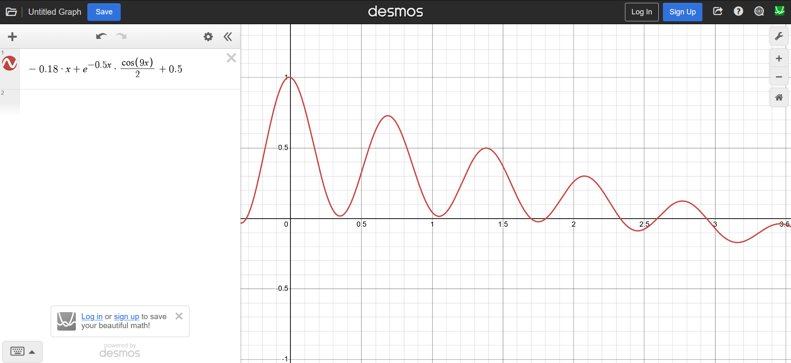
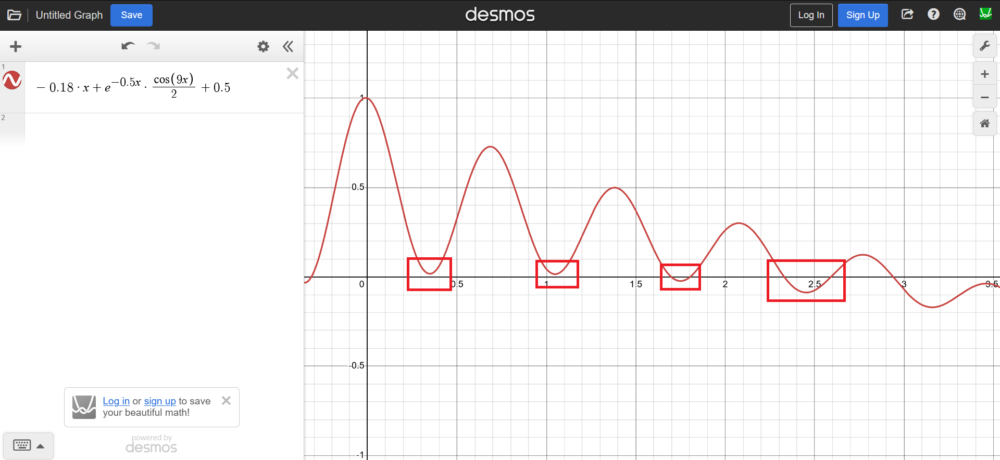
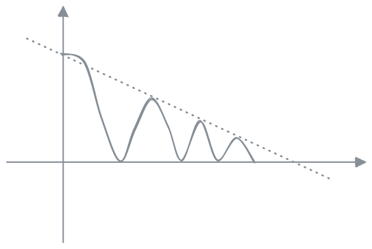
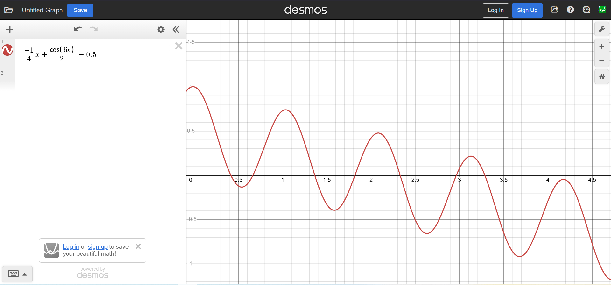
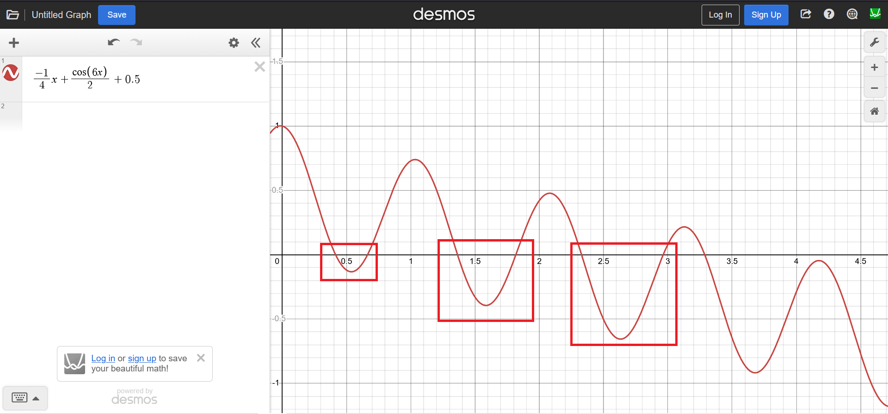

# A SolidJS bare bone canvas implementation of the twinkle particle heart button of Whimsical Animation


You can play with it [here](https://wham-heart-button-twinkle-particle-two.vercel.app/).

This is my original canvas based implementation of this animation. After spending quite a bit of time tinkering with the animation, I decided to share it here in case it saves someone else's time.

Check out the source code on the [file HeartButton.tsx](https://github.com/quoctuan0405/wham-heart-button-twinkle-particle-solid/blob/main/src/HeartButton.tsx).

## The hard part

Assume you already watch the rocket animation on canvas video, the hard part of this animation is how to create the :sparkles:*twinkling effect*:sparkles:.

You'll need the opacity of a particle to fluctuate between 0 and 1 while simutanenously go toward 0.

UPDATE:

Here's the function I came up with:



opacity = -0.18 * time + e ^ (-0.5 * time) * cos(9 * time) / 2 + 0.5

- The -0.18 * time is the "base" function to move downward toward 0
- In order to for it to fluctuate but fluctuate gradually less, I add e ^ (-0.5 * time) * cos(9 * time)
- The / 2 + 0.5 is to make the e ^ (-0.5 * time) * cos(9 * time) fluctuate between 0 and 1 instead of the -1 to 1 of the cosine function

I think this function is decent but it's still not perfect.

In some part it went negative (which mean your particle will disappear for a bit before appear again), while in some part it does not touch 0.



I think the "perfect function" should be like this:



...but I can't think of anyway to create that exact function.

It seems the peak of the decay sine wave function Ae^(kt) * sin(wt) does not follow a kind of -ax function.

If you come up with any solution, I'd love to know!

ORIGINAL:

Here's the function I came up with:



opacity = 1/4 * time + cos(6 * time) / 2 + 0.5

- The 1/4 * time is the "base" function to move downward toward 0
- In order to for it to fluctuate, I add cos(6 * time)
- The / 2 + 0.5 is to make the cos(6 * time) fluctuate between 0 and 1 instead of the -1 to 1 of the cosine function

This function is by no means perfect since quite a lot times, it went negative. This means that your particle will disappear for a while before appear and twinking again.



## Ways I've thinking about

### Polynomial

Maybe you can create this using polynomial function like this:
- First, create the derivative of that function: f'(t) = (t - 0) * (t - 1) * (t - 2) * (t - 3).
- This means that the function will peak and then valley at 0, 1, 2, 3 second.
- Then based on that to calculate the function f(t) (the integral of f'(t))
- On canvas, instead of thinking opacity = f(t), thinking in terms of opacity += f'(t) * delta

I do think about this, but the integral of that f'(t) is nearly kill me.

### Sine wave gradual decay

Maybe another way I can think of is the integral of this gradual decay sine wave function: 

f'(t) = e^(kt) * sin(wt) - 1/4

According to ChatGPT, the integral of this is:

f(t) = (e^(kt) / (k^2 + w^2)) * (k * sin(wt) + w * cos(wt)) - 1/4x + C

...but you probably just kill me at this point.

Despite 12 years having to study math at school, I'm totally not nearly equip to deal with this kind of shit.

## Setup

Install the dependencies:

```bash
pnpm install
```

## Get started

Start the dev server, and the app will be available at [http://localhost:3000](http://localhost:3000).

```bash
pnpm run dev
```

Build the app for production:

```bash
pnpm run build
```

Preview the production build locally:

```bash
pnpm run preview
```

## Learn more

To learn more about Rsbuild, check out the following resources:

- [Rsbuild documentation](https://rsbuild.rs) - explore Rsbuild features and APIs.
- [Rsbuild GitHub repository](https://github.com/web-infra-dev/rsbuild) - your feedback and contributions are welcome!
